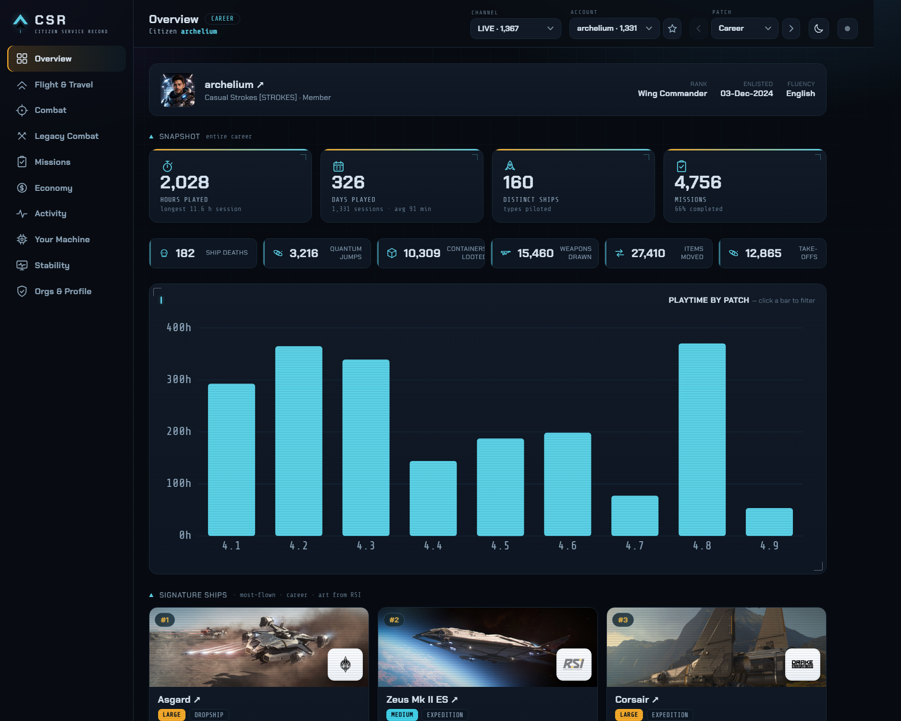
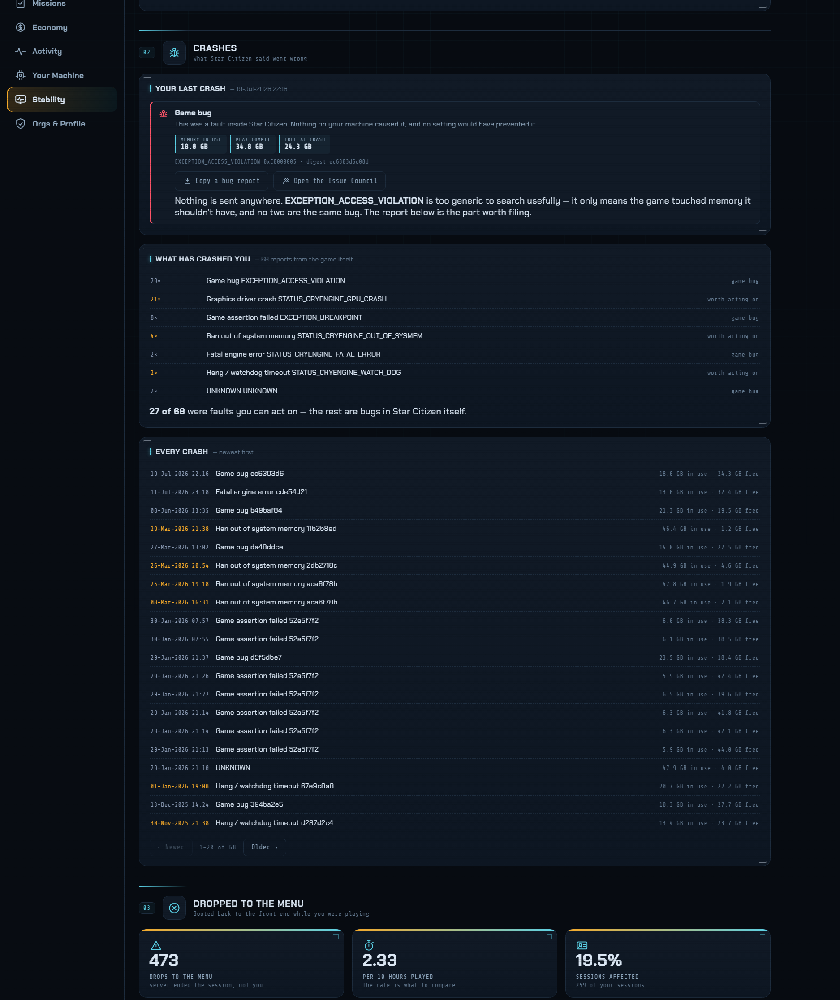
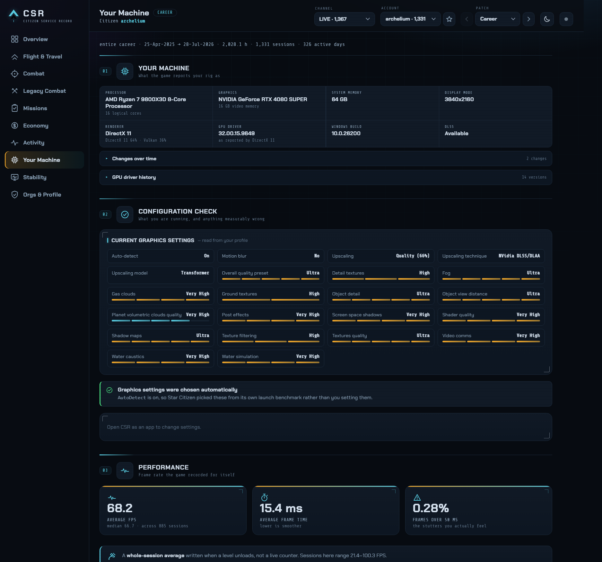
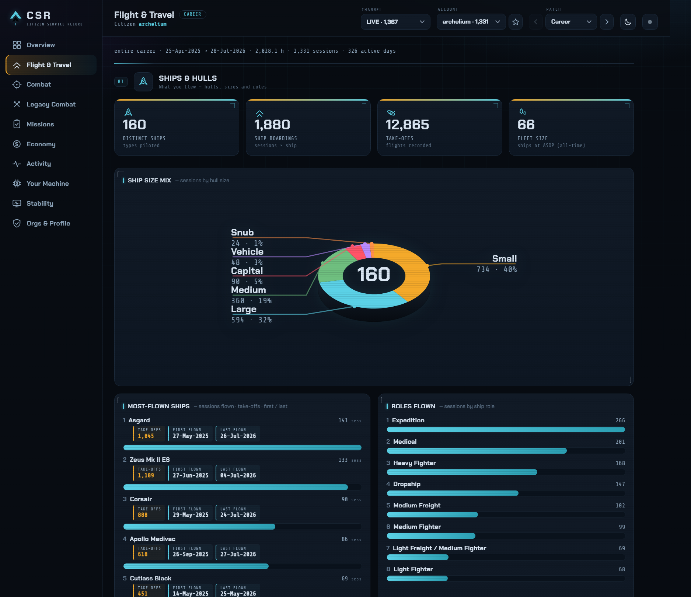

# CSR — Citizen Service Record

A **career-stats dashboard for Star Citizen**. CSR mines your entire client-log
history and builds a single, interactive, HUD-styled web page: playtime, ships
flown, missions, favorite guns, quantum travel, aUEC spent — broken down by
patch and by account.

Pure Python **standard library** (no pip installs to run from source).

**Patch coverage — tested on 4.1 → 4.9** (July 2026). CSR reads the version out of each
log rather than working from a fixed list, so **older patches will often work too**, and
newer ones should. Neither is tested: Star Citizen changes its log format between
builds, so expect gaps or misparsed figures outside that range — and please
[report them](https://github.com/archelium/csr/issues) if you hit any.




<details>
<summary><b>More screenshots</b> — Stability, Your Machine, Flight &amp; Travel</summary>

### Stability

Crashes named in the game's own words, a full crash history, and **drops to the main
menu** — the "it booted me for no reason" moment, which Star Citizen records as *you*
asking to disconnect, and which nothing else counts.



### Your Machine

The rig the game saw, your graphics settings in the menu's own wording, and a
configuration check that flags what is measurably wrong.



### Flight &amp; Travel

Ships flown, hull-size mix, roles, and quantum travel.



</details>

---

## Get started

Pick whichever fits you:

### 1. The app (recommended — no Python needed)
**Extract the zip**, then double-click **`CSR.exe`**. A console window opens and
your browser loads the dashboard at `http://127.0.0.1:7878`.

- **First run:** CSR tries to auto-detect your install. If it can't, it pops up a
  folder picker — choose your **`StarCitizen`** folder (the one that *contains*
  `LIVE`, and `PTU` / `TECH-PREVIEW` if you have them), so CSR can build a
  separate career for each channel. Picking a single `LIVE` folder also works —
  CSR finds its siblings automatically.
- **Refresh:** the **⟳** button (top-right of the page) re-scans your logs. It only
  re-reads files that changed, so it takes about a second; **Full re-scan** is there
  for after a CSR update.
- **Everything is driven from the page.** The console window hides itself once CSR is
  ready — the **status light** at the top-right shows whether CSR is running, and lets
  you shut it down, restart it, or bring the console back. (Start it with `--console`
  if you'd rather keep the window.) A page can't *start* CSR, so if the light is grey,
  run `CSR.exe` again.
- **Self-contained / portable:** CSR keeps its config, generated page and cached
  art in a **`CSR-data` folder right next to the exe** — delete that folder to wipe
  everything, or run the whole thing from a USB stick with no trace left on your
  PC. (If you put the exe somewhere read-only like *Program Files*, it falls back
  to `%LOCALAPPDATA%\CSR`.) **Nothing leaves your PC** except fetching ship/weapon
  artwork and your public RSI profile.

> Run it from a normal folder you extracted it to (Desktop, Downloads, a folder
> you made) — not from *inside* the zip, or its data won't stick.

> Windows may show a blue **SmartScreen** "unknown publisher" warning (the exe
> isn't code-signed). Click **More info → Run anyway**.

### Updating from an earlier version

CSR is portable, so updating is just **replace the exe**:

1. Close CSR — use **Shut down** in the status light, or Ctrl+C in its console.
2. Extract the new `CSR.exe` **over the old one**, in the same folder.
3. Start it. That's it — your settings, cached artwork and career history live in
   the `CSR-data` folder beside the exe and are picked up automatically.

**Don't delete `CSR-data`** — from v1.1.0 on it holds your session *archive*, which
keeps sessions Star Citizen has since deleted from your log folder. If you want a
belt-and-braces backup first, open CSR and use **💾 Backup & transfer → Export**.

What happens on your first run of v1.3.0, depending on where you're coming from:

| Coming from | What to expect |
|---|---|
| **v1.0.0** | v1.0.0 kept no archive, so your history is rebuilt from whatever logs you still have. If your saved folder was `…\StarCitizen\LIVE`, CSR now finds `PTU` and `TECH-PREVIEW` beside it on its own — **no need to re-pick a folder** — and a **Channel** dropdown appears if it finds any. |
| **v1.1.0 / v1.2.0** | Your archive carries over untouched. |
| **any** | The first scan re-reads **every** log (a minute or so). This is deliberate: each release fixes parsing bugs or extracts new data, so nothing older is trusted. It happens once — after that CSR starts, and refreshes, in about a second. |

Coming from **v1.2.0** specifically, the first run also *moves* some existing numbers,
because v1.3.0 converts session times from the log's UTC stamps to your own clock: the
weekday × hour heatmap shifts by your timezone offset, and a late-night session can move
to the previous or next day. That is a correction, not a regression — v1.2.0 was plotting
a 10pm session at 3pm on this machine.

Numbers may *change* after updating — that's the point. Patch 4.1 gained reloads and
item transfers it never had; some stats that used to read `0` now correctly read
`N/A` (see the CHANGELOG for exactly which, and why).

One limit worth knowing: sessions already in your archive whose original logs Star
Citizen has since **deleted** can't gain data from a newer parser — there's nothing
left to re-read. In *Stability* those sessions are counted as **unrated**
and said so, rather than being assumed to have ended well.

### 2. From source, as the app
```bash
python sc_stats.py --serve      # or double-click "Start CSR.bat"
```
Same experience as the exe (folder picker, Refresh button), but needs Python 3.9+.

### 3. From source, one-shot static file
```bash
python sc_stats.py --open       # writes + opens CSR.html, then exits
python sc_stats.py --live "D:\...\StarCitizen\LIVE"   # point at a specific LIVE folder
```
Produces a **single self-contained `CSR.html`** you can open any time or
share. (No server, so no in-page Refresh button — re-run to update.)

---

## What's in the dashboard

A left sidebar of sections; a top bar with an **account** dropdown, a **patch**
dropdown (*Career*, then every patch found in your logs), a light/dark toggle, and
Refresh. Every section
is scoped by account × patch. On **Overview**, click any bar in *Playtime by
Patch* to filter to that patch (and *↩ View career* to reset).

- **Overview** — RSI profile, snapshot KPIs, click-to-filter playtime-by-patch,
  signature top-3 ships & guns with artwork
- **Flight & Travel** — *ships & hulls* (distinct ships, boardings, take-offs, fleet
  size, most-flown with first/last flown dates, hull-size mix, roles) and
  *travel & navigation* (quantum jumps, jumps per session/hour, systems visited)
- **Combat** — *ship combat* (how you lost ships), *FPS combat* (loadout ranked by
  how often each weapon was drawn, plus reloads and carry), and *looting & inventory*
  (containers looted, items transferred, corpse loots)
- **Legacy Combat** — real PvP/PvE kills & K/D from patches 4.1–4.3 (PU vs Arena
  Commander toggle) — the only builds that still logged combat client-side
- **Missions** — outcomes, completion rate, mission types
- **Economy** — **real aUEC spent**, top items bought, what you buy, cargo & commodities
- **Blueprints** — every crafting blueprint the game has handed you (4.7+), by category and searchable, plus what you're still missing against the full ~1,600-blueprint catalogue
- **Activity** — playtime by month, weekday×hour heatmap, session-length mix, streaks
- **Your Machine** — the rig you played on (CPU, GPU + VRAM, memory, driver, renderer,
  Windows build) and when it changed; a **configuration check** that flags measurable
  problems (most usefully: *Star Citizen is rendering on the wrong graphics card*);
  **frame rate** per session; the game's own hardware benchmark; and a **shareable rig
  card**
- **Stability** — everything that goes wrong, with a **live dot in the sidebar** that
  pulses while CSR is tailing your logs:
  - **Crash analysis** naming the fault in the game's own words, **every crash listed**
    (paged, newest first, with times), and a **Copy a bug report** button that formats
    build, exception, crash digest, memory and rig for an Issue Council filing
  - **Dropped to the main menu** — the "it just booted me for no reason" moment, counted
    for the first time. Star Citizen logs it as *you* asking to disconnect, which is why
    nothing has ever counted it; CSR separates it from a real quit by what the client did
    first, and reports the rate per 10 hours played with a by-month trend
  - How your sessions **ended**, per patch
- **Live crash alerts** — while CSR is running it watches your log and pops an alert on
  the dashboard within seconds of a crash or a genuine disconnect, saying what broke and
  whether it was your PC or CIG's servers. Routine disconnect chatter is filtered out.
  A **🔔 bell in the top bar** carries a badge and keeps every alert raised while the page
  has been open; *Stability → Live monitoring* shows the watcher's status lights. CSR also checks whether
  `StarCitizen.exe` is running, so it knows the difference between a log being written
  because you're playing and one being written as the game shuts down — it reads only the
  process *name*, the same thing Task Manager lists, and never opens a handle to the game
- **Orgs & Profile** — RSI dossier + public orgs (main + affiliates)

Stats the game stopped recording (or never did) show **N/A** rather than a
misleading `0` — see the CHANGELOG for which, and why.

### Playing on more than one PC

Star Citizen deletes old logs, and each machine only ever sees its own. CSR keeps a
running **archive** so your career survives both. Open **💾 Backup & transfer**:

| You have | Use |
|---|---|
| A **log folder copied** from the other PC | **Import logs** → pick the folder, or paste its path. CSR reads it straight off disk — you don't need to install CSR over there. |
| CSR **installed on both** machines | **Export** on the other PC, then **Import backup** here. |
| Just want a safety copy | **Export** — one file with your whole career. |

Sessions merge and de-duplicate by identity, so importing the same folder or file
twice never double-counts. Copied logs still declare which channel they came from,
so they land in the right career even if you dropped them in the wrong folder.

> **Known issue.** The *Choose log folder…* dialog is a native Windows one, and Windows
> often opens it **behind** your browser — check the taskbar if the button seems to hang.
> The **"or paste the folder path"** box next to it doesn't depend on window focus and
> always works.

Everything is real, from your logs. Backend class IDs become in-fiction names
(`RSI_Zeus_ES` → **Zeus Mk II ES**, `klwe_rifle_energy_01` → **Klaus & Werner
Gallant**); ship names/art come from the official **RSI Ship Matrix**, item names
from the **SC-Wiki** item data. Artwork and fonts are embedded, so the page is a
single self-contained file. Internet is used only on the run that builds the page.

**What CSR can't show** — kills, K/D, accuracy, damage, and your aUEC *balance /
earnings*: Star Citizen stopped writing those to the client log in the 2026 builds
(combat + wallet went server-side). aUEC **spend** *is* logged (per shop purchase),
so the Economy tab is real. "Favorite guns" is by **times drawn into your hand**,
not shots fired. Frame rate **is** recorded, but as a **whole-session average**
written when a level unloads — not a live counter, so a session that ran at 90 FPS in
space and 30 in a city averages out in between.

**CSR won't claim to know your optimal settings.** A session average is too coarse to
judge one settings change against another. What it does instead:

- **Diagnoses** — your settings as the game stores them, plus a short list of things
  that are objectively wrong or below CIG's published requirements (most usefully:
  *Star Citizen is rendering on the wrong graphics card*).
- **Delegates** — one click re-runs Star Citizen's own **auto-detect**, which picks
  every setting from the benchmark the game runs on your hardware. That's CIG's
  calibration, and it beats any rule of thumb CSR could apply.
- **Nudges** — moves the overall quality preset one step so you can judge for yourself.

CSR only ever writes those **two values**, never the individual quality sliders. Your
settings file is **backed up before the first change**, writes are refused while Star
Citizen is running, and **one click restores the original**.

---

## Building the exe

```bash
build_exe.bat          # installs PyInstaller if needed, then builds dist\CSR.exe
```
or manually: `python -m PyInstaller csr.spec --noconfirm`. The one-file exe
(~8 MB) bundles the game-data caches; share that single file. To give it an icon,
drop a `csr.ico` next to `csr.spec` and rebuild.

---

## Files

| File | Purpose |
|------|---------|
| `sc_stats.py` | ⭐ The whole app — log scan → aggregate → HTML/CSS/JS dashboard + `--serve` local app. |
| `sc_names.py` | Name resolution & web fetch: ship matrix, item names, RSI profile/orgs, artwork + fonts → data URIs. |
| `csr.spec`, `build_exe.bat` | PyInstaller build for `dist/CSR.exe`. |
| `Start CSR.bat` | Double-click launcher for the source app. |
| `sc_*.json`, `sc_fonts_embed.css` | Cached game data / fonts (delete to refetch). |
| `sc_analyzer.py` | **Deprecated** live death-tracker (kept for reference; not maintained). |
| `tools/make_icon.py` | Draws the chevron mark → `csr.ico`. Developer tool, **not** part of the app: it's the one file needing a package (Pillow), and the generated `.ico` is committed so a clone builds without it. |

---

*CSR reads only your local Star Citizen logs and your public RSI profile. It never
sends your data anywhere.*
